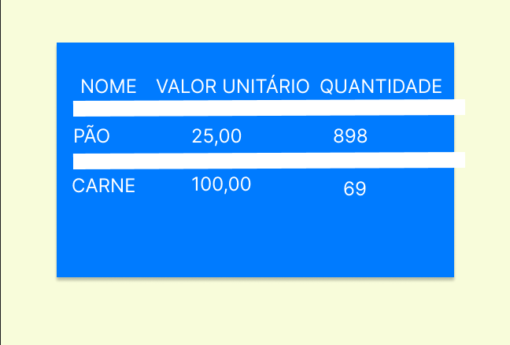
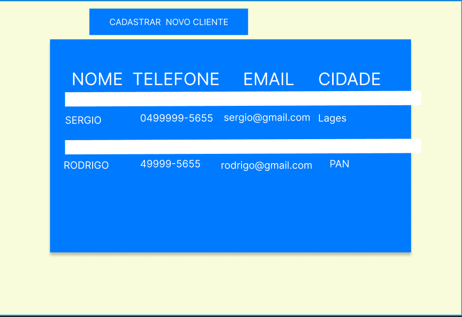
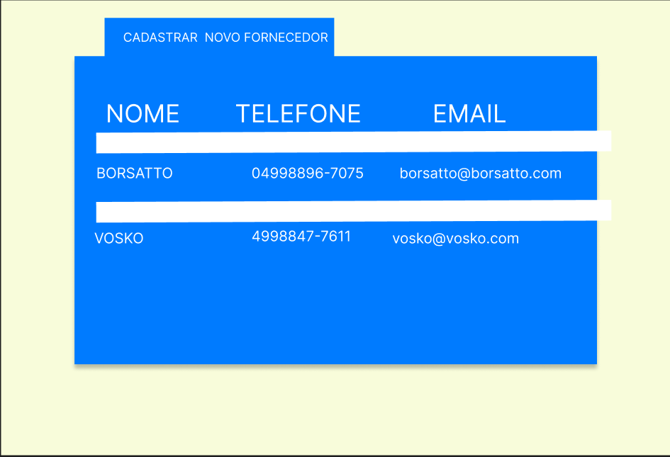

# **emporio_alegria**
É um aplicativo de gestão de supermercados.

Nele, o funcionário pode cadastrar clientes, fornecedores, produtos, bem como vendas realizadas no mercado.

Para acessar o cadastro, ele precisa acessar a home, exemplo: home_clientes para clientes_cadastro. Sendo semelhantemente com home_produtos e home_fornecedores.

Este projeto estará conectado a um Banco de Dados do tipo SQL.

E será feito no front-end com JS, CSS e HTML.
O Backend ficará com o PHP.

## **Backlog do projeto**

- Criar README DO PROJETO
- Criar páginas no FIGMA
  - inicial
  - vendas
  - produtos
  - clientes
  - fornecedores
- Criar página inicial, que direciona para clientes, produtos, fornecedores, vendas.
- Criar campos para vendas
  - Campos:
    - id_venda
    - id_funcionario
    - id_produto
    - id_cliente ? null
    - quatidade_produto
- Criar página produtos
  - Criar campos para produtos
    - Campos:
      - id_produto
      - descrição
      - estoque_minimo
      - estoque_maximo
      - valor_unitario
      - quantidade
- Criar página clientes 
  - Criar campos para clientes
    - Campos:
      - id_cliente
      -   nome
      -   endereço
      -   telefone
      -   email
      -   cidade
- Criar página fornecedores
  - Criar campos para fornecedores:
    - id_fornecedor
    - nome_empresa
    - email
    - telefone
- Criar Banco de Dados MYSQL chamado alegria.
  - Criar tabelas vendas, produtos, clientes e fornecedores.
- Criar sistema de Login
  - Acessar a página inicial da área logada.
  - cadastrar novos usuário
- validações de formulários com JS
  -   venda
  -   produtos
  -   clientes
  -   fornecedores
  -   login
 - Criação dos styles do site com CSS
   -   venda
   -   produtos
   -   clientes
   -   fornecedores
   -   login
  - Responsividade CSS
- padrão de código:
  -   tabela SQL - MAIÚSCULO e plura [CLIENTES]
  -   formulário html - minúsculo e plural [produtos.php]
  -   input html - minúsculo e singular [email, nome, telefone]
  -   campos da tabela SQL - MAIÚSCULO e singular [NOME, TELEFONE, EMAIL]
  -   classes CSS = singular e primeira maiúscula juntando por hífen - [Menu-Left]
  -   id CSS = singular e minúsculo juntado por hífen - [produto-right]

## **Linguagens utilizadas**

HTML, CSS, JS, PHP e MySQL

)

)

)

## **Como ficará o projeto**

## **Log de Eventos**

### 10/06
- Criação de repositório Github
- Feito Git clone
- Criadas branch dev, html, js, php_w_sql
- entregue release de versão do sistema: 1.0, 2.0, 3.0, 4.0, 5.0
- criado banco de dados 
- criado código SQL de criação de tabelas
  - clientes
  - produtos
  - fornecedores
- criado código SQL para SELECT, INSERT, DELETE das tabelas:
  - clientes
  - produtos
  - fornecedores
- criado HTML das páginas
  - clientes
  - produtos
  - fornecedores
- criado validações com JavaScript
### 11/06 - Eliabe
- função deletar fornecedor por id usando MySQL, PHP, HTML
- entregue release: 6.0
- Criada pasta com funções php que interagem com banco de Dados MySQL
- modificação de caminhos e pastas do projeto. Agora está organizado em:
  - index.php
  - app:
    - assets
      - css
      - js
    - funcoes_php
    - paginas
    - clientes
    - fornecedores
    - produtos
    - vendas
    - sql
      - create_table
      - delete
      - insert
      - update

- feature inserir produtos, clientes, fornecedores através de HTML que interage com Js, PHP e vai ao MySQL
- criação de funções para listar e inserir dados de clientes, fornecedores e produtos
- modulação de código

## 16/06 - Eliabe
Foi feito o tratamento de erros
  - usuario não autorizado
  - 0 results
Foi feito a modular e funcao delete 
  - cliente
  - produto
  - fornecedor

